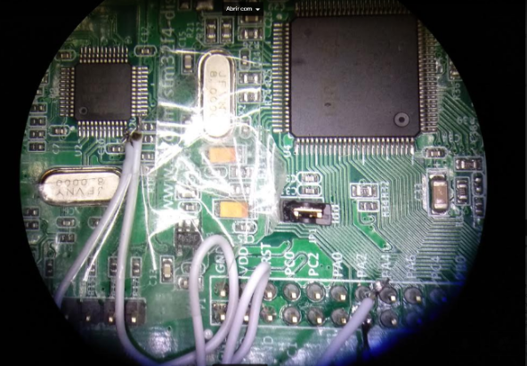

# STM32F407 Discovery HAL programming VCOM Port
This is a simple example of using the HAL driver layer to connect by the soldering hack of the Virtual COM Port.

## Description
This is project for the STM32F407 DISCOVERY KIT version DISC1, began by auto generating the initial files with the configurations made and then adding the code of this small project.  
To make this source code work, I had to solder 2 wires connections between the main board microcontroller STM32F407GV and the board programming microcontroller that has a Virtual COM port that you can connect to the main PC by using a Serial terminal program like Putty.  
The program configures the GPIO's of the LED to make a neat LED animation and the serial port to write and read a Menu to the user, so it can choose the task to perform.  
This can be used as a simple starting project using the Virtual COM Port of the board.  
For the 2 wire connections that you will have to solder, see the Starting Manual of the board. I used a microscope for doing it.

## Small hack connection at the microscope

Virtual COM Port wires  
 

## License
Because this code uses the auto-generated template code of HAL from the STM32CubeIDE I maintain the ST license.  
This software component is licensed by ST under Ultimate Liberty license SLA0044.

## Have fun!
Best regards  
Joao Nuno Carvalho